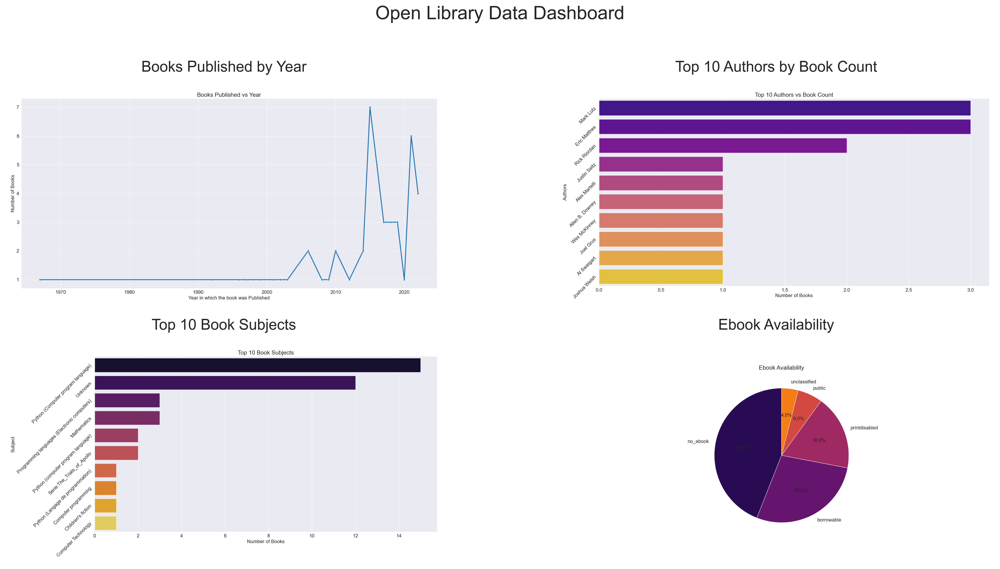

# API INTEGRATION AND DATA VISUALIZATION

COMPANY : CODTECH IT SOLUTIONS

NAME : NIRAJ KUMAR YADAV

INTERN ID : CT04DF2492

DOMAIN : PYTHON PROGRAMMING

DURATION : FOUR WEEKS

MENTOR : NEELA SANTHOSH KUMAR

---

# 📚 Open Library Data Visualization

This project fetches book data from the [Open Library API](https://openlibrary.org/developers/api), processes it, and visualizes key insights such as:

- Book publication trends over the years  
- Most frequent authors  
- Common book subjects  
- Ebook availability  

A final consolidated dashboard is also created for a summarized visual overview.

---

## 🔧 Features

- **API Integration**: Retrieves data based on search keywords using Open Library’s `search.json` endpoint.
- **Custom User Input**: Users can specify search terms and page numbers.
- **Data Formatting**: Cleans and normalizes key fields such as `author_name`, `subject`, `language`, and `ebook_access`.
- **Visualizations**:
  - Line plot: Books published per year
  - Bar charts: Top 10 authors and subjects
  - Pie chart: Ebook availability
- **Dashboard Export**: All visualizations are embedded into a 2x2 grid dashboard and saved as `dashboard.png`.

---

## 🛠️ Tech Stack

- Python 3
- Libraries: `requests`, `pandas`, `matplotlib`, `seaborn`

---

## 🖼️ Screenshot



---

## 📝 How to Run

1. **Clone the Repository** or download the Python script.
2. **Install Dependencies** (if not already):
   ```bash
   pip install -r requirements.txt
   ```
3. **Run the Script**:
   ```bash
   python "api_integration_and_data_visualization.py"
   ```
4. **Provide Input** when prompted (optional — defaults to "Python" and page 1).
5. **Check Output**:
   - Individual visualizations saved as `results-*.png`
   - Full dashboard saved as `dashboard.png`

---

## 📁 Project Structure

```
.
├── api_integration_and_data_visualization.py
├── requirements.txt
├── README.md
├── OUTPUT_Screenshot/            
│   └── S1.png
├── MY_RESULTS/            
    └── dashboard.png
    └── results-No_of_Books_vs_Year.png
    └── results-Top_Authors.png
    └── results-top_subjects.png
    └── results-Ebook_Avail.png
```

---

## 📌 Notes

- The Open Library API may return limited or inconsistent data depending on search terms.
- Default search keyword is `"Python"`.
- Default page number is `1`.

---

## 📬 Author

Developed by **NIRAJ KUMAR YADAV**
